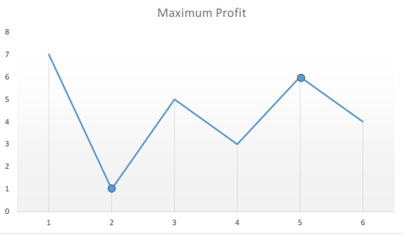

Algorithm

Say the given array is:

[7, 1, 5, 3, 6, 4]

If we plot the numbers of the given array on a graph, we get:

Profit Graph

The points of interest are the peaks and valleys in the given graph. 
We need to find the largest peak following the smallest valley. We can maintain two variables - minprice and maxprofit
corresponding to the smallest valley and maximum profit (maximum difference between selling price and minprice) 
obtained so far respectively.