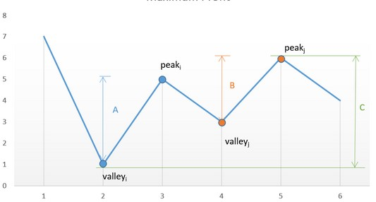

Algorithm

Say the given array is:

[7, 1, 5, 3, 6, 4].

If we plot the numbers of the given array on a graph, we get:

Profit Graph

If we analyze the graph, we notice that the points of interest are the consecutive valleys and peaks.

Mathematically speaking: TotalProfit = ∑i(height(peaki)−height(valleyi)) 

The key point is we need to consider every peak immediately following a valley to maximize the profit. In case we skip 
one of the peaks (trying to obtain more profit), we will end up losing the profit over one of the transactions leading 
to an overall lesser profit.

For example, in the above case, if we skip peakipeak_ipeaki​ and valleyjvalley_jvalleyj​ trying to obtain more profit by 
considering points with more difference in heights, the net profit obtained will always be lesser than the one obtained 
by including them, since CCC will always be lesser than A+BA+BA+B.